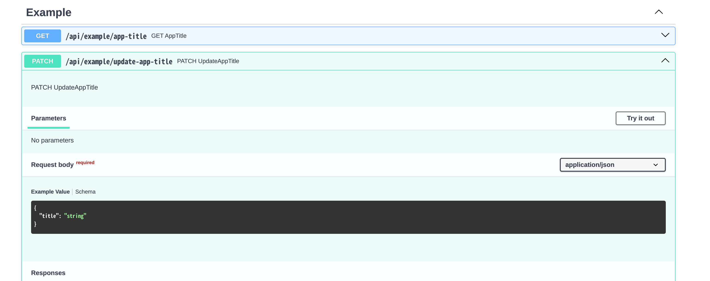
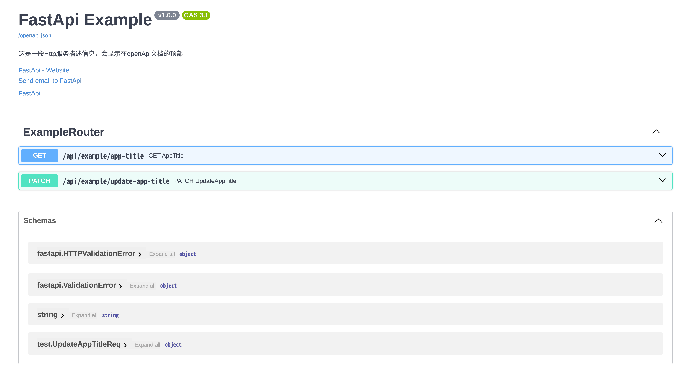
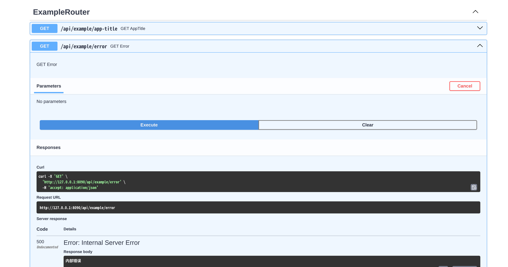
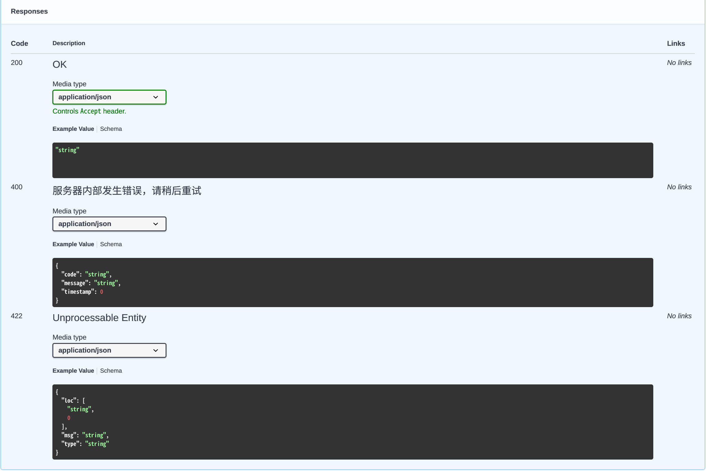
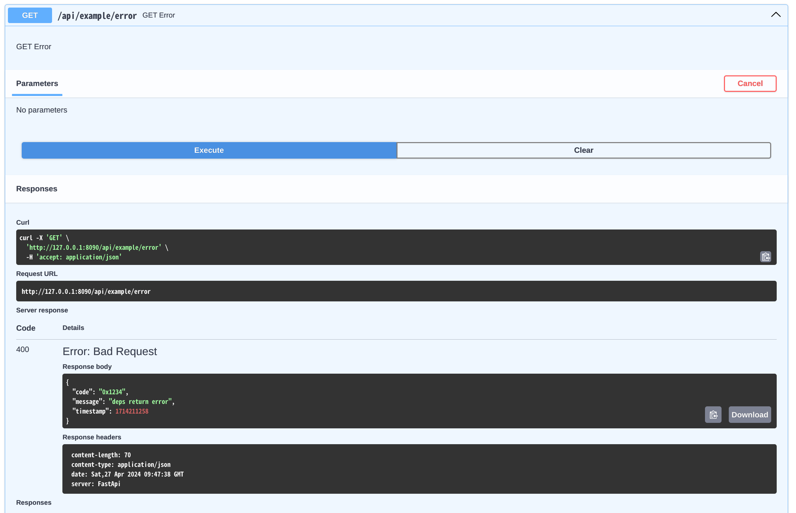

# FastApi-Golang (包装器)

- 类似[`python-FastApi`](https://github.com/tiangolo/fastapi)的`Golang`实现;
- 提供`OpenApi`文档的自动生成，提供`Swagger`和`Redoc`文档;
- 通过一次代码编写同时生成文档和参数校验，无需编写swagger的代码注释;
- 直接在路由函数中使用经过校验的请求参数，无需通过`ShouldBind`等方法;
- 支持请求参数的自动校验：
    - 包括：`Query`、`Path`、`Header`、`Cookie`、`Form`、`File` 参数的自动校验(`Header`、`Cookie`、`Form`、`File`正在支持中)
    - `Body`参数的自动校验，支持`json`/`multipart`格式，`json`
      基于[`validator`](https://github.com/go-playground/validator)
- `包装器`，不限制底层的`HTTP框架`，支持`gin`、`fiber`等框架，并可轻松的集成到任何框架中;

# Usage 使用说明:

- 参考[`group_router_test.go`](./test/group_router_test.go)
- 参考[`group_router_example_test.go`](./test/group_router_example_test.go)

```bash
go get https://github.com/Chendemo12/fastapi
```

## 快速实现

```
// 创建一个结构体实现fastapi.GroupRouter接口
type ExampleRouter struct {
	fastapi.BaseGroupRouter
}

func (r *ExampleRouter) Prefix() string { return "/api/example" }

// 定义一个 GET 请求，路由为 `/api/example/app-title`, 返回值为string，无请求参数
func (r *ExampleRouter) GetAppTitle(c *fastapi.Context) (string, error) {
	return "FastApi Example", nil
}


// 创建app
app := fastapi.New()
mux := fiberWrapper.Default()
app.SetMux(mux)
// 绑定路由
app.IncludeRouter(&ExampleRouter{})
// 启动
app.Run("0.0.0.0", "8090")
```

## 具体解释

- 创建一个`Wrapper`对象：

```
import "github.com/Chendemo12/fastapi"

// 可选的 fastapi.Config 参数
app := fastapi.New(fastapi.Config{
    Version:     "v1.0.0",
    Description: "这是一段Http服务描述信息，会显示在openApi文档的顶部",
    Title:       "FastApi Example",
})

```


<div style="text-align: center;">显示效果</div>

- 指定底层HTTP路由器，也称为`Mux`, 为兼容不同的`Mux`，还需要对`Mux`进行包装，其定义为`MuxWrapper`：

```
import "github.com/Chendemo12/fastapi/middleware/fiberWrapper"

// 此处采用默认的内置Fiber实现, 必须在Run启动之前设置
mux := fiberWrapper.Default()
app.SetMux(mux)

// 或者自定义Fiber实现
fiberEngine := fiber.New(fiber.Config{
    Prefork:       false,                   // 多进程模式
    CaseSensitive: true,                    // 区分路由大小写
    StrictRouting: true,                    // 严格路由
    ServerHeader:  "FastApi",               // 服务器头
    AppName:       "fastapi.fiber",         // 设置为 Response.Header.Server 属性
    ColorScheme:   fiber.DefaultColors,     // 彩色输出
    JSONEncoder:   utils.JsonMarshal,       // json序列化器
    JSONDecoder:   utils.JsonUnmarshal,     // json解码器
})                                          // 创建fiber引擎
mux := fiberWrapper.NewWrapper(fiberEngine) // 创建fiber包装器
app.SetMux(mux)
```

- 创建路由：
  实现`fastapi.GroupRouter`接口，并创建方法以定义路由：

```
// 创建一个结构体实现fastapi.GroupRouter接口
type ExampleRouter struct {
	fastapi.BaseGroupRouter
}

func (r *ExampleRouter) Prefix() string { return "/api/example" }

func (r *ExampleRouter) GetAppTitle(c *fastapi.Context) (string, error) {
	return "FastApi Example", nil
}

type UpdateAppTitleReq struct {
	Title string `json:"title" validate:"required" description:"App标题"`
}

func (r *ExampleRouter) PatchUpdateAppTitle(c *fastapi.Context, form *UpdateAppTitleReq) (*UpdateAppTitleReq, error) {
	return form, nil
}

// 注册路由
app.IncludeRouter(&ExampleRouter{})
```


<div style="text-align: center;">显示效果</div>

- 启动：

```
// 阻塞运行
app.Run("0.0.0.0", "8090") 
```

- [完整示例 ./test/group_router_example_test.go](./test/group_router_example_test.go)：


<div style="text-align: center;">显示效果</div>

## 方法说明

### 路由方法定义

- 路由定义的关键在于实现[`GroupRouter`](./group_router.go) 接口:

| 方法                                      | 说明                                            |
|-----------------------------------------|-----------------------------------------------|
| Prefix() string                         | 路由组前缀                                         |
| Tags() []string                         | 分组标签                                          |
| PathSchema() pathschema.RoutePathSchema | 路由解析规则，对路由前缀和路由地址都有效                          |
| Summary() map[string]string             | 为路由添加摘要说明，key为原始的方法名，value为摘要                 |
| Description() map[string]string         | 为路由添加详细说明，key为原始的方法名，value为详细描述（支持markdown显示） |
| Path() map[string]string                | 自定义路径，可用于定义路径，key为原始的方法名，value为路径             |

- 对于路由组`ExampleRouter`来说：
    - `Tags` 为 `ExampleRouter`
    - 路由组前缀为手动定义的`/api/example`

#### 满足路由定义的方法要求：

- 方法需为指针接收器
- 方法必须是导出方法
- 方法名必须以HTTP操作名开头或结尾：`Post`, `Patch`, `Get`, `Delete`, `Put`
- 返回值必须为2个参数：`(XXX, error)`, 第二个参数必须是`error`类型，第一个参数为任意参数，但不建议是`map`类型，不能是nil
- 第一个入参必须是`*fastapi.Context`,
    - 对于`Post`, `Patch`,  `Put`  **至少有一个**自定义参数作为请求体，如果不需要请求体参数则用`fastapi.None`代替
    - 对于`Get`, `Delete` 则**只能有一个**自定义结构体参数作为查询参数、cookies、header等参数

### 有关方法入参的解析规则：

- 对于`Get`，`Delete`：
    - 有且只有一个结构体入参，被解释为查询/路径等参数
- 对于`Post`, `Patch`, `Put`:
    - 最后一个入参被解释为请求体，其他入参除`fastapi.File`外被解释为查询/路径等参数

#### 参数定义

- 建议用`结构体`来定义所有参数：
- 参数的校验和文档的生成遵循`Validator`的标签要求
- 任何情况下`json`标签都会被解释为参数名，对于查询参数则优先采用`query`标签名
- 任何模型都可以通过`SchemaDesc() string`方法来添加模型说明，作用等同于`python.__doc__`属性

### 文件上传

- 通过在`Post`, `Put`, `Patch` 方法中添加`*fastapi.File`参数，即可实现文件上传;
- 请求体类型固定为`multipart/form-data`

```
// 仅上传文件
func (r *ExampleRouter) PostUploadFile(c *fastapi.Context, file *fastapi.File) (int64, error) {
	return 1, nil
}

type UpdateUserInfoReq struct {
	Name  string `json:"name" validate:"required"`
	Email string `json:"email" validate:"required"`
}

// 上传文件和json数据
func (r *ExampleRouter) PostUploadFileWithForm(c *fastapi.Context, file *fastapi.File, param *UpdateUserInfoReq) (int64, error) {
	return 1, nil
}

```

#### 注意：

当同时存在文件和json参数时，请把`fastapi.File`放在`json`参数之前,
`PostUploadFileWithForm(c *fastapi.Context, file *fastapi.File, param *UpdateUserInfoReq)`,
此情况下，`json`参数会作为`请求体`参数；
如果`fastapi.File`放在`json`参数之后，则`json`参数会作为`query`参数，如
`PostUploadFileWithForm(c *fastapi.Context, param *UpdateUserInfoReq, file *fastapi.File)`

由于反射过程中无法获得参数的名称，所以文件和json部分的字段名默认为`file`和`param`, 但可通过以下方法进行修改（必须在启动前设置）：

```go
fastapi.SetMultiFormFileName("files")
fastapi.SetMultiFormParamName("data")
```

### 文件下载

- 通过返回`*fastapi.FileResponse`对象来向客户端发送文件；

```
// 以附件形式下载文件
func (r *ExampleRouter) GetFileAttachment(c *fastapi.Context, param *DownloadFileReq) (*fastapi.FileResponse, error) {
	return fastapi.FileAttachment("../README.md", "README.md"), nil
}

// 直接发送文件内容给客户端
func (r *ExampleRouter) GetSendFile(c *fastapi.Context) (*fastapi.FileResponse, error) {
	return fastapi.SendFile("../README.md"), nil
}

```

- 对于文件下载支持以下方式：

| 方法             | 作用                                               |
|----------------|--------------------------------------------------|
| SendFile       | 向客户端发送本地文件，此时会读取文件内容，并将文件内容作为响应体返回给客户端           |
| FileAttachment | 以附件形式返回本地文件，自动设置"Content-Disposition"，浏览器会触发自动下载 |
| FileFromReader | 从io.Reader中读取文件并返回给客户端                           |
| Stream         | 发送字节流到客户端，Content-Type为application/octet-stream  |

### 路由url解析 [RoutePathSchema](./pathschema/pathschema.go)

- 方法开头或结尾中包含的http方法名会被忽略，对于方法中包含多个关键字的仅第一个会被采用：
    - `PostDelet` - > 路由为`delte`， 方法为`Post`
- 允许通过`PathSchema() pathschema.RoutePathSchema`来自定义解析规则，支持以下规则：
    - `LowerCaseDash`：全小写-短横线
    - `LowerCaseBackslash`：全小写段路由
    - `LowerCamelCase`：将结构体名称按单词分割后转换为小驼峰的形式后作为相对路由
    - `LowerCase`：将方法名按单词分割后全部转换为小写字符再直接拼接起来
    - `UnixDash`/ `Dash`：将方法名按单词分割后用"-"相连接
    - `Underline`：将方法名按单词分割后用"_"相连接
    - `Backslash`：按单词分段，每一个单词都作为一个路由段
    - `Original`：原始不变，保持结构体方法名(不含HTTP方法名),只拼接成合法的路由
    - `AddPrefix`：用于在分段路由基础上添加一个前缀字符，作用于每一段路径，通常与其他方案组合使用
    - `AddSuffix`：用于在分段路由基础上添加一个后缀字符，作用于每一段路径，通常与其他方案组合使用
    - `Composition`：组合式路由格式化方案, 通过按顺序执行多个 `RoutePathSchema` 获得最终路由

- 详细示例可见 [pathschema_test.go](./pathschema/pathschema_test.go)

### Config 配置项 [app.go:Config](./app.go)

| 参数                                 | 作用                                                                                                                   | 是否必选 | 默认值                 |
|------------------------------------|----------------------------------------------------------------------------------------------------------------------|------|---------------------|
| Title                              | APP标题                                                                                                                | 否    | 1.0.0               |
| Version                            | APP版本号                                                                                                               | 否    | FastAPI Application |
| Description                        | APP描述                                                                                                                | 否    | FastAPI             |
| ShutdownTimeout                    | 平滑关机,单位秒                                                                                                             | 否    | 5                   |
| DisableSwagAutoCreate              | 禁用OpenApi文档，但是不禁用参数校验                                                                                                | 否    | false               |
| StopImmediatelyWhenErrorOccurs     | 是否在遇到错误字段时立刻停止校验, 对于有多个请求参数时，默认会检查每一个参数是否合法，并最终返回所有的错误参数信息，设为true以在遇到一个错误参数时停止后续的参数校验并直接返回错误信息。                      | 否    | false               |
| ContextAutomaticDerivationDisabled | 禁止为每一个请求创建单独的context.Context 。为每一个请求单独创建一个派生自Wrapper.Context()的ctx是十分昂贵的开销，但有时有时十分必要的，禁用后调用 Context.Context() 将会产生错误 | 否    | false               |

### Wrapper 配置项  [app.go:Wrapper](./app.go)

#### 添加`启动/关闭`前同步事件 ，等同于 `FastAPI.on_event()`,

- event_type: `startup` / `shutdown`；
- 同步执行，应避免阻塞；
- `startup` 会在初始化完成后、listen之前依次调用；
- `shutdown` 会在Context cancel 之后，mux shutdown之前依次调用；

#### 设置`设置路由错误信息格式化函数 SetRouteErrorFormatter`

- 由于路由方法`handler`的定义中，其返回值必须有2个参数，且最后一个参数必须为 error 接口，因此当`handler`
  返回错误时，如何合理的返回错误消息也十分的重要；

- 默认情况下当`handler`返回错误时，`Wrapper` 会返回`500错误码`和`string`类型的错误消息；
  

- 允许通过 `Wrapper.SetRouteErrorFormatter` 方法来自定义错误消息:

```
// 自定义错误格式
type ErrorMessage struct {
    Code      string `json:"code,omitempty" description:"错误码"`
    Message   string `json:"message,omitempty" description:"错误信息"`
    Timestamp int64  `json:"timestamp,omitempty"`
}

// 格式化路由函数错误消息
func FormatErrorMessage(c *fastapi.Context, err error) (statusCode int, message any) {
    return 400, &ErrorMessage{
        Code:      "0x1234",
        Message:   err.Error(),
        Timestamp: time.Now().Unix(),
    }
}

// 自定义错误格式，fastapi.RouteErrorOpt 仅用于添加文档说明
app.SetRouteErrorFormatter(FormatErrorMessage, fastapi.RouteErrorOpt{
  StatusCode:   400,
  ResponseMode: &ErrorMessage{},
  Description:  "服务器内部发生错误，请稍后重试",
})
```



<div style="text-align: center;">错误文档</div>

- 此时的接口返回值更新为：


<div style="text-align: center;">接口响应</div>

- `RouteErrorFormatter`的定义如下：

```
  // RouteErrorFormatter 路由函数返回错误时的处理函数，可用于格式化错误信息后返回给客户端
  //
  //	程序启动时会主动调用此方法用于生成openApi文档，所以此函数不应返回 map等类型，否则将无法生成openApi文档
  //
  //	当路由函数返回错误时，会调用此函数，返回值会作为响应码和响应内容, 返回值仅限于可以JSON序列化的消息体
  //	默认情况下，错误码为500，错误信息会作为字符串直接返回给客户端
  type RouteErrorFormatter func(c *Context, err error) (statusCode int, resp any)
```

- 其中实际接口响应的状态码以`RouteErrorFormatter`的返回值为准，而非`fastapi.RouteErrorOpt`中的配置，
  `fastapi.RouteErrorOpt`的配置仅仅作用于文档显示。

#### 使用请求钩子 DependenceHandle

```
// DependenceHandle 依赖/钩子函数 Depends/Hook
type DependenceHandle func (c *Context) error
```

- 对于`Wrapper`而言，其本质是一个装饰器，是对具体的`Mux`的包装，因此其自身并没有中间件的概念，同时也是为了避免与`Mux`
  的中间件引起冲突，有关的`Wraper`与`Mux`的核心交互定义如下：
- `Wraper`会将使用者定义的每一个`handler`进行二次包装，并作为`Mux`的`handler`注册到路由器上，其包装后的定义如下：

```
  // Handler 路由函数，实现逻辑类似于装饰器
  //
  // 路由处理方法(装饰器实现)，用于请求体校验和返回体序列化，同时注入全局服务依赖,
  // 此方法接收一个业务层面的路由钩子方法 RouteIface.Call
  //
  // 方法首先会查找路由元信息，如果找不到则直接跳过验证环节，由路由器返回404
  // 反之：
  //
  //  1. 申请一个 Context, 并初始化请求体、路由参数等
  //  2. 之后会校验并绑定路由参数（包含路径参数和查询参数）是否正确，如果错误则直接返回422错误，反之会继续序列化并绑定请求体（如果存在）序列化成功之后会校验请求参数的正确性，
  //  3. 校验通过后会调用 RouteIface.Call 并将返回值绑定在 Context 内的 Response 上
  //  4. 校验返回值，并返回422或将返回值写入到实际的 response
  func (f *Wrapper) Handler(ctx MuxContext) error {}
```

- 建议将`跨域访问`，`Recover`等方法注册为`Mux`的中件间；而将日志、认证等业务方法注册为`Wraper`
  的依赖，但是其2者并没有十分明显的区别，绝大部分情况都可以互相替换；

- `Wraper.Handler` 的实现是一个顺序执行的过程，其作为一个整体，因此是无法在`Mux`的中间件中对其进行访问和拦截的，为此
  `Wraper`暴露出了一些锚点，用于控制`Wraper.Handler`的执行流：

    - `Wrapper.UsePrevious`： 添加一个`校验前依赖函数`，此依赖函数会在：`请求参数校验前`调用
    - `Wrapper.UseAfter`： 添加一个`校验后依赖函数`(也即路由前), 此依赖函数会在：`请求参数校验后-路由函数调用前`执行
    - `Wrapper.UseBeforeWrite`： 在`数据写入响应流之前执行的钩子方法`; 可用于日志记录, 所有请求无论何时终止都会执行此方法
    - `Wrapper.Use`： `UseAfter`的别名
      ```
      // Use 添加一个依赖函数(锚点), 数据校验后依赖函数
      //
      // 由于 Wrapper 的核心实现类似于装饰器, 而非常规的中间件,因此无法通过 MuxWrapper 的中间件来影响到 Wrapper 的执行过程;
      // 因此 Wrapper 在关键环节均定义了相关的依赖函数，类似于hook，以此来控制执行流程;
      //
      //	与python-FastApi的Depends不同的地方在于：
      //		python-FastApi.Depends接收Request作为入参，并将其返回值作为路由函数Handler的入参;
      //		而此处的hook不返回值，而是通过 Context.Set 和 Context.Get 来进行上下文数据的传递，并通过返回 error 来终止后续的流程;
      //		同时，由于 Context.Set 和 Context.Get 是线程安全的，因此可以放心的在依赖函数中操作 Context;
      //	   	依赖函数的执行始终是顺序进行的，其执行顺序是固定的：
      //	   	始终由 UsePrevious -> (请求参数)Validate -> UseAfter -> (路由函数)RouteHandler -> (响应参数)Validate -> UseBeforeWrite -> exit;
      //
      // 此处的依赖函数有校验前依赖函数和校验后依赖函数,分别通过 Wrapper.UsePrevious 和 Wrapper.UseAfter 注册;
      // 当请求参数校验失败时不会执行 Wrapper.UseAfter 依赖函数, 请求参数会在 Wrapper.UsePrevious 执行完成之后被触发;
      // 如果依赖函数要终止后续的流程,应返回 error, 错误消息会作为消息体返回给客户端, 响应数据格式默认为500+string,可通过 Wrapper.SetRouteErrorFormatter 进行修改;
      func (f *Wrapper) Use(hooks ...DependenceHandle) *Wrapper {
          return f.UseAfter(hooks...)
      }
      ```

    - 使用示例：

      ```
      func BeforeValidate(c *fastapi.Context) error {
          c.Set("before-validate", time.Now())
      
          return nil
      }
      
      func PrintRequestLog(c *fastapi.Context) {
          fastapi.Info("请求耗时: ", time.Since(c.GetTime("before-validate")))
          fastapi.Info("响应状态码: ", c.Response().StatusCode)
      }
      
      func returnErrorDeps(c *fastapi.Context) error {
          return errors.New("deps return error")
      }
      
      app.UsePrevious(BeforeValidate)
      app.Use(returnErrorDeps)
      app.UseBeforeWrite(PrintRequestLog)
      ```

      

      <div style="text-align: center;">显示效果</div>

      	```bash
      	2024/04/27 17:47:38 group_router_test.go:522: INFO	请求耗时:  10.372µs
      	2024/04/27 17:47:38 group_router_test.go:523: INFO	响应状态码:  400
      	2024-04-27 17:47:38    GET	/api/example/error    400
      	2024/04/27 17:47:38 group_router_test.go:522: INFO	请求耗时:  11.855µs
      	2024/04/27 17:47:38 group_router_test.go:523: INFO	响应状态码:  400
      	2024-04-27 17:47:38    GET	/api/example/error    400
      	2024/04/27 17:47:38 group_router_test.go:522: INFO	请求耗时:  6.739µs
      	2024/04/27 17:47:38 group_router_test.go:523: INFO	响应状态码:  400
      	2024-04-27 17:47:38    GET	/api/example/error    400
      	```

# 二次开发选项

## TODO

- [./TODO.md](./TODO.md)

## 查看在线文档

```bash
# 安装godoc
go install golang.org/x/tools/cmd/godoc@latest
godoc -http=:6060

# 或：pkgsite 推荐
go install golang.org/x/pkgsite/cmd/pkgsite@latest
cd fastapi-go/
pkgsite -http=:6060 -list=false
# 浏览器打开：http://127.0.0.1:6060/github.com/Chendemo12/fastapi
```

## `struct`内存对齐

```bash
go install golang.org/x/tools/go/analysis/passes/fieldalignment/cmd/fieldalignment@latest

fieldalignment -fix ./... 
```

## 打包静态资源文件

```shell
# 安装工具
go get -u github.com/go-bindata/go-bindata/...
go install github.com/go-bindata/go-bindata/...

# 下载资源文件
#https://fastapi.tiangolo.com/img/favicon.png
#https://cdn.jsdelivr.net/npm/swagger-ui-dist@5/swagger-ui.css
#https://cdn.jsdelivr.net/npm/swagger-ui-dist@5/swagger-ui-bundle.js
#https://cdn.jsdelivr.net/npm/redoc@next/bundles/redoc.standalone.js

# 打包资源文件到openapi包
go-bindata -o openapi/css.go --pkg openapi internal/static/...

```
