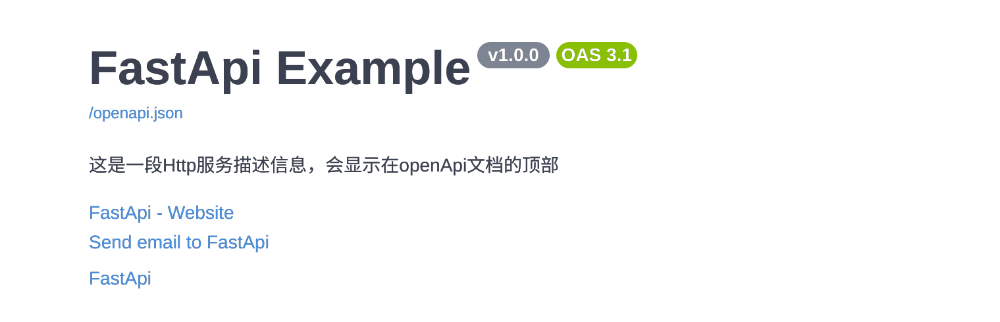
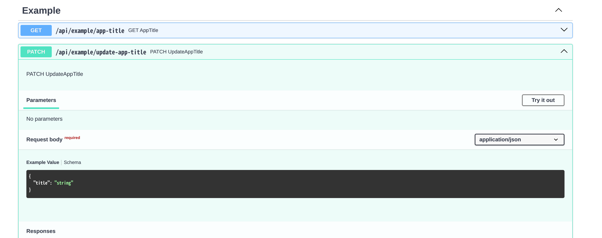
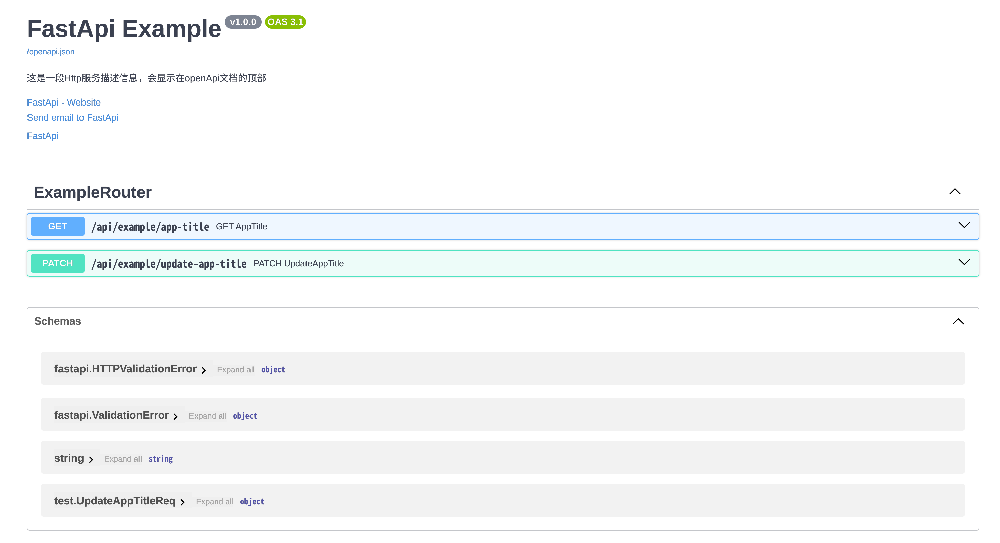

# FastApi-Golang (包装器)

- [`python-FastApi`](https://github.com/tiangolo/fastapi)的`Golang`实现;
- 提供`OpenApi`文档的自动生成，提供`Swagger`和`Redoc`文档;
- 通过一次代码编写同时生成文档和参数校验，无需编写swagger的代码注释;
- 直接在路由函数中使用经过校验的请求参数，无需通过`ShouldBind`等方法;
- 支持请求参数的自动校验：
    - 包括：`Query`、`Path`、`Header`、`Cookie`、`Form`、`File` 参数的自动校验(`Header`、`Cookie`、`Form`、`File`正在支持中)
    - `Body`参数的自动校验，支持`json`/`multipart`格式，`json`
      基于[`validator`](https://github.com/go-playground/validator)
- `包装器`，不限制底层的`HTTP框架`，支持`gin`、`fiber`等框架，并可轻松的集成到任何框架中;

## （一）快速实现

### 安装依赖

```bash
go get https://github.com/Chendemo12/fastapi
```

```
// 创建一个结构体实现fastapi.GroupRouter接口
type ExampleRouter struct {
	fastapi.BaseGroupRouter
}

func (r *ExampleRouter) Prefix() string { return "/api/example" }

// 定义一个 GET 请求，路由为 `/api/example/app-title`, 返回值为string，无请求参数
func (r *ExampleRouter) GetAppTitle(c *fastapi.Context) (string, error) {
	return "FastApi Example", nil
}


// 创建app
app := fastapi.New()
mux := fiberWrapper.Default()
app.SetMux(mux)
// 绑定路由
app.IncludeRouter(&ExampleRouter{})
// 启动
app.Run("0.0.0.0", "8090")
```

## （二）逐步创建完整的RESTfull API服务

### 1. 创建一个`Wrapper`对象：

```
import "github.com/Chendemo12/fastapi"

// 可选的 fastapi.Config 参数
app := fastapi.New(fastapi.Config{
    Version:     "v1.0.0",
    Description: "这是一段Http服务描述信息，会显示在openApi文档的顶部",
    Title:       "FastApi Example",
})

```


<div style="text-align: center;">显示效果</div>

### 2. 指定底层HTTP路由器，也称为`Mux`, 为兼容不同的`Mux`，还需要对`Mux`进行包装，其定义为`MuxWrapper`：

```
import "github.com/Chendemo12/fastapi/middleware/fiberWrapper"

// 此处采用默认的内置Fiber实现, 必须在Run启动之前设置
mux := fiberWrapper.Default()
app.SetMux(mux)

// 或者自定义Fiber实现
fiberEngine := fiber.New(fiber.Config{
    Prefork:       false,                   // 多进程模式
    CaseSensitive: true,                    // 区分路由大小写
    StrictRouting: true,                    // 严格路由
    ServerHeader:  "FastApi",               // 服务器头
    AppName:       "fastapi.fiber",         // 设置为 Response.Header.Server 属性
    ColorScheme:   fiber.DefaultColors,     // 彩色输出
    JSONEncoder:   utils.JsonMarshal,       // json序列化器
    JSONDecoder:   utils.JsonUnmarshal,     // json解码器
})                                          // 创建fiber引擎
mux := fiberWrapper.NewWrapper(fiberEngine) // 创建fiber包装器
app.SetMux(mux)
```

### 3. 创建路由：

实现`fastapi.GroupRouter`接口，并创建方法以定义路由：

```
// 创建一个结构体实现fastapi.GroupRouter接口
type ExampleRouter struct {
	fastapi.BaseGroupRouter
}

func (r *ExampleRouter) Prefix() string { return "/api/example" }

func (r *ExampleRouter) GetAppTitle(c *fastapi.Context) (string, error) {
	return "FastApi Example", nil
}

type UpdateAppTitleReq struct {
	Title string `json:"title" validate:"required" description:"App标题"`
}

func (r *ExampleRouter) PatchUpdateAppTitle(c *fastapi.Context, form *UpdateAppTitleReq) (*UpdateAppTitleReq, error) {
	return form, nil
}

// 注册路由
app.IncludeRouter(&ExampleRouter{})
```


<div style="text-align: center;">显示效果</div>

### 4. 启动：

```
// 阻塞运行
app.Run("0.0.0.0", "8090") 
```

- [完整示例 ./test/group_router_example_test.go](./test/group_router_example_test.go)：


<div style="text-align: center;">显示效果</div>

## （三）更多文档

- **[RESTful API 开发指南](./docs/restful-api.md)** — 路由定义、方法签名、文件上传/下载、SSE 推流、URL 解析、配置项、请求钩子等完整开发文档
- **[MCP 支持](./docs/mcp.md)** — Model Context Protocol 集成，将 Go 方法暴露为 AI Agent 可调用的 Tool / Resource /
  Prompt
- **[Mux 集成指南](./docs/mux-integration.md)** — 为其他 HTTP 框架（Echo、Net/HTTP 等）实现适配器的完整开发文档
- **[TODO](./TODO.md)** — 规划中的功能

# 二次开发选项

## TODO

- [./TODO.md](./TODO.md)

## 查看在线文档

```bash
# 安装godoc
go install golang.org/x/tools/cmd/godoc@latest
godoc -http=:6060

# 或：pkgsite 推荐
go install golang.org/x/pkgsite/cmd/pkgsite@latest
cd fastapi-go/
pkgsite -http=:6060 -list=false
# 浏览器打开：http://127.0.0.1:6060/github.com/Chendemo12/fastapi
```

## `struct`内存对齐

```bash
go install golang.org/x/tools/go/analysis/passes/fieldalignment/cmd/fieldalignment@latest

fieldalignment -fix ./... 
```

## 打包静态资源文件

```shell
# 安装工具
go get -u github.com/go-bindata/go-bindata/...
go install github.com/go-bindata/go-bindata/...

# 下载资源文件
#https://fastapi.tiangolo.com/img/favicon.png
#https://cdn.jsdelivr.net/npm/swagger-ui-dist@5/swagger-ui.css
#https://cdn.jsdelivr.net/npm/swagger-ui-dist@5/swagger-ui-bundle.js
#https://cdn.jsdelivr.net/npm/redoc@next/bundles/redoc.standalone.js

# 打包资源文件到openapi包
go-bindata -o openapi/css.go --pkg openapi internal/static/...

```
