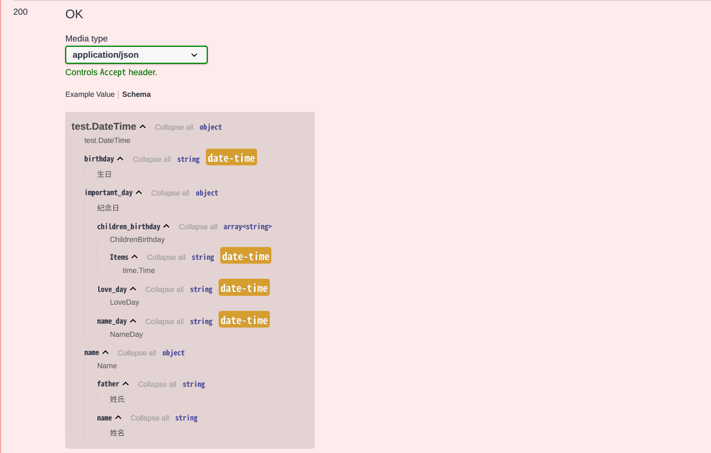
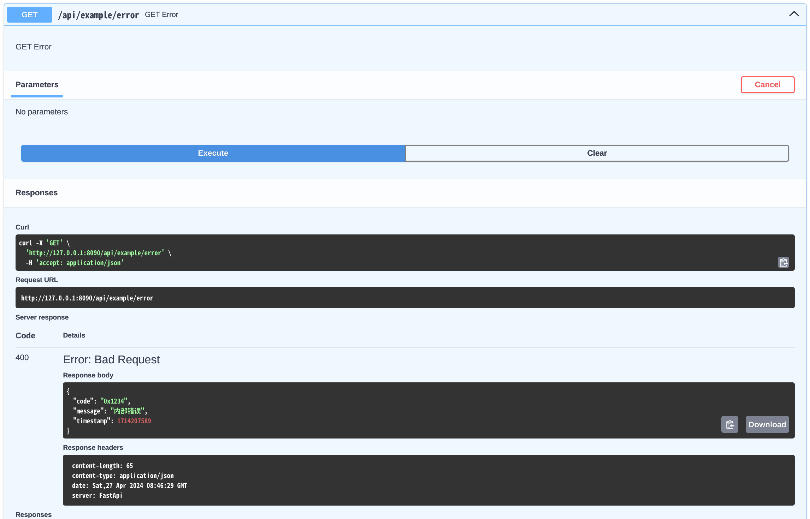

# FastApi-Golang (包装器)

- 类似[`python-FastApi`](https://github.com/tiangolo/fastapi)的`Golang`实现;
- 提供`OpenApi`文档的自动生成，提供`Swagger`和`Redoc`文档;
- 通过一次代码编写同时生成文档和参数校验，无需编写swagger的代码注释;
- 直接在路由函数中使用经过校验的请求参数，无需通过`ShouldBind`等方法;
- 支持请求参数的自动校验：
    - 包括：`Query`、`Path`、`Header`、`Cookie`、`Form`、`File` 参数的自定校验(`Header`、`Cookie`、`Form`、`File`正在支持中)
    - `Body`参数的自动校验，支持`json`/`multipart`格式，`json`
      基于[`validator`](https://github.com/go-playground/validator)
- `包装器`，不限制底层的`HTTP框架`，支持`gin`、`fiber`等框架，并可轻松的集成到任何框架中;


# Usage 使用说明:

- 参考[`group_router_test.go`](./test/group_router_test.go)
- 参考[`group_router_example_test.go`](./test/group_router_example_test.go)

```bash
go get https://github.com/Chendemo12/fastapi
```


## 1. 快速实现

1. 创建一个`Wrapper`对象：

```go
import "github.com/Chendemo12/fastapi"

// 可选的 fastapi.Config 参数
app := fastapi.New(fastapi.Config{
    Version:     "v1.0.0",
    Description: "这是一段Http服务描述信息，会显示在openApi文档的顶部",
    Title:       "FastApi Example",
})

```


<div style="text-align: center;">显示效果</div>

2. 指定底层HTTP路由器，也称为`Mux`, 为兼容不同的`Mux`，还需要对`Mux`进行包装，其定义为`MuxWrapper`：

```go
import "github.com/Chendemo12/fastapi/middleware/fiberWrapper"

// 此处采用默认的内置Fiber实现, 必须在启动之前设置
mux := fiberWrapper.Default()
app.SetMux(mux)

// 或者自定义Fiber实现
fiberEngine := fiber.New(fiber.Config{
    Prefork:       false,                   // 多进程模式
    CaseSensitive: true,                    // 区分路由大小写
    StrictRouting: true,                    // 严格路由
    ServerHeader:  "FastApi",               // 服务器头
    AppName:       "fastapi.fiber",         // 设置为 Response.Header.Server 属性
    ColorScheme:   fiber.DefaultColors,     // 彩色输出
    JSONEncoder:   utils.JsonMarshal,       // json序列化器
    JSONDecoder:   utils.JsonUnmarshal,     // json解码器
})                                          // 创建fiber引擎
mux := fiberWrapper.NewWrapper(fiberEngine) // 创建fiber包装器
app.SetMux(mux)
```

3. 创建路由：

- 实现`fastapi.GroupRouter`接口，并创建方法以定义路由：

```go
// 创建一个结构体实现fastapi.GroupRouter接口
type ExampleRouter struct {
	fastapi.BaseGroupRouter
}

func (r *ExampleRouter) Prefix() string { return "/api/example" }

func (r *ExampleRouter) GetAppTitle(c *fastapi.Context) (string, error) {
	return "FastApi Example", nil
}

type UpdateAppTitleReq struct {
	Title string `json:"title" validate:"required" description:"App标题"`
}

func (r *ExampleRouter) PatchUpdateAppTitle(c *fastapi.Context, form *UpdateAppTitleReq) (*UpdateAppTitleReq, error) {
	return form, nil
}

// 注册路由
app.IncludeRouter(&ExampleRouter{})
```


<div style="text-align: center;">显示效果</div>

4. 启动：

```
app.Run("0.0.0.0", "8090") // 阻塞运行
```

5. [完整示例](./test/group_router_example_test.go)：

```go
package test

import (
	"github.com/Chendemo12/fastapi"
	"github.com/Chendemo12/fastapi/middleware/fiberWrapper"
	"testing"
)

// ExampleRouter 创建一个结构体实现fastapi.GroupRouter接口
type ExampleRouter struct {
	fastapi.BaseGroupRouter
}

func (r *ExampleRouter) Prefix() string { return "/api/example" }

func (r *ExampleRouter) GetAppTitle(c *fastapi.Context) (string, error) {
	return "FastApi Example", nil
}

type UpdateAppTitleReq struct {
	Title string `json:"title" validate:"required" description:"App标题"`
}

func (r *ExampleRouter) PatchUpdateAppTitle(c *fastapi.Context, form *UpdateAppTitleReq) (*UpdateAppTitleReq, error) {
	return form, nil
}

func TestExampleRouter(t *testing.T) {
	// 可选的 fastapi.Config 参数
	app := fastapi.New(fastapi.Config{
		Version:     "v1.0.0",
		Description: "这是一段Http服务描述信息，会显示在openApi文档的顶部",
		Title:       "FastApi Example",
	})

	// 此处采用默认的内置Fiber实现, 必须在启动之前设置
	mux := fiberWrapper.Default()
	app.SetMux(mux)

	// 注册路由
	app.IncludeRouter(&ExampleRouter{})

	app.Run("0.0.0.0", "8090") // 阻塞运行
}

```


<div style="text-align: center;">显示效果</div>


## 2. 详细实现

### 2.1 路由方法定义

- 路由定义的关键在于实现[`GroupRouter`](./group_router.go) 接口:

  ```go
  // GroupRouter 结构体路由组定义
  // 用法：首先实现此接口，然后通过调用 Wrapper.IncludeRoute 方法进行注册绑定
  type GroupRouter interface {
  	// Prefix 路由组前缀，无需考虑是否以/开头或结尾
  	// 如果为空则通过 PathSchema 方案进行格式化
  	Prefix() string
  	// Tags 标签，如果为空则设为结构体名称的大驼峰形式，去掉可能存在的http方法名
  	Tags() []string
  	// PathSchema 路由解析规则，对路由前缀和路由地址都有效
  	PathSchema() pathschema.RoutePathSchema
  	// Summary 允许对单个方法路由的文档摘要信息进行定义
  	// 方法名:摘要信息
  	Summary() map[string]string
  	// Description 方法名:描述信息
  	Description() map[string]string
  	// Path 允许对方法的路由进行重载, 方法名:相对路由
  	// 由于以函数名确定方法路由的方式暂无法支持路径参数, 因此可通过此方式来定义路径参数
  	// 但是此处定义的路由不应该包含查询参数
  	// 路径参数以:开头, 查询参数以?开头
  	Path() map[string]string
  
  	// InParamsName 允许对函数入参名称进行修改，仅适用于基本类型和time.Time类型的参数
  	// 由于go在编译后无法获得函数或方法的入参名称，只能获得入参的类型和偏移量，
  	// 因此在openapi的文档生成中，作为查询参数的函数入参无法正确显示出查询参数名称，取而代之的是手动分配的一个虚假参数名，此名称会影响api的调用和查询参数的解析
  	// 对于此情况，推荐使用结构体来定义查询参数，以获得更好的使用体验
  	// 此外，对于入参较少的情况，允许通过手动的方式来分配一个名称。
  	//
  	//
  	//	对于方法：ManyGet(c *Context, age int, name string, graduate bool, source float64)
  	//
  	//	在未手动指定名称的情况下, 查询参数解析为：
  	//		age int => int_2
  	//		name string => string_3
  	//		graduate bool => bool_4
  	//		source float64 => float64_5
  	//
  	//	通过一下方式来手动指定名称：
  	//		{
  	//			"ManyGet": {
  	//				2: "age",
  	//				3: "name",
  	//				4: "graduate",
  	//				5: "source",
  	//			},
  	//		}
  	InParamsName() map[string]map[int]string
  }
  ```

- 对于路由组`ExampleRouter`来说：

  - `Tags` 为 `ExampleRouter`
  - 路由组前缀为手动定义的`/api/example`

  

#### 2.1.1 满足路由定义的方法要求：

- 方法需为指针接收器
- 方法必须是导出方法
- 方法名必须以HTTP操作名开头或结尾：`Post`, `Patch`, `Get`, `Delete`, `Put` 
- 返回值必须为2个参数：`(XXX, error)`, 第二个参数必须是`error`类型，第一个参数为任意参数，但不建议是`map`类型，不能是nil
- 第一个入参必须是`fastapi.Context`, 
  - 对于`Post`, `Patch`,  `Put`  **至少有一个**自定义参数作为请求体，如果不需要请求体参数则用`fastapi.None`代替
  - 对于`Get`, `Delete` 则**只能有一个**自定义结构体参数作为查询参数，cookies，header等参数


#### 2.1.2 有关方法入参的解析规则：

- 对于`Get`，`Delete`：
  - 有且只有一个结构体入参，被解释为查询/路径等参数
- 对于`Post`, `Patch`, `Put`:
  - 最后一个入参被解释为请求体，其他入参被解释为查询/路径等参数


#### 2.1.3 参数定义

- 建议用`结构体`来定义所有参数：
- 参数的校验和文档的生成遵循`Validator`的标签要求
- 任何情况下`json`标签都会被解释为参数名，对于查询参数则优先采用`query`标签名
- 任何模型都可以通过`SchemaDesc() string`方法来添加模型说明，作用等同于`python.__doc__`属性

示例1：

```go
type IPModel struct {
	IP     string `json:"ip" description:"IPv4地址"`
	Detail struct {
		IPv4     string `json:"IPv4" description:"IPv4地址"`
		IPv4Full string `json:"IPv4_full" description:"带端口的IPv4地址"`
		Ipv6     string `json:"IPv6" description:"IPv6地址"`
	} `json:"detail" description:"详细信息"`
}

func (m IPModel) SchemaDesc() string { return "IP信息" }

type DomainRecord struct {
	IP struct {
		Record *IPModel `json:"record" validate:"required" description:"解析记录"`
	} `json:"ip" validate:"required"`
	Addresses []struct {
		Host string `json:"host"`
		Port string `json:"port"`
	} `json:"addresses" validate:"required,gte=1" description:"主机地址"`
	Timestamp int64 `json:"timestamp" description:"时间戳"`
}
```

- 其文档如下：

  

  <div style="text-align: center;">显示效果</div>

  


示例2：

```go
type DateTime struct {
	Name         *Name     `json:"name" query:"name"`
	Birthday     time.Time `json:"birthday" query:"birthday" description:"生日"` // 日期时间类型
	ImportantDay *struct {
		LoveDay          time.Time   `json:"love_day"`
		NameDay          time.Time   `json:"name_day"`
		ChildrenBirthday []time.Time `json:"children_birthday"`
	} `json:"important_day,omitempty" description:"纪念日"`
}
```



<div style="text-align: center;">显示效果</div>


### 2.2 Config 配置项 [app.go:Config](./app.go)

| 参数                               | 作用                                                         | 是否必选 | 默认值              |
| ---------------------------------- | ------------------------------------------------------------ | -------- | ------------------- |
| Title                              | APP标题                                                      | 否       | 1.0.0               |
| Version                            | APP版本号                                                    | 否       | FastAPI Application |
| Description                        | APP描述                                                      | 否       | FastAPI             |
| ShutdownTimeout                    | 平滑关机,单位秒                                              | 否       | 5                   |
| DisableSwagAutoCreate              | 禁用OpenApi文档，但是不禁用参数校验                          | 否       | false               |
| StopImmediatelyWhenErrorOccurs     | 是否在遇到错误字段时立刻停止校验, 对于有多个请求参数时，默认会检查每一个参数是否合法，并最终返回所有的错误参数信息，设为true以在遇到一个错误参数时停止后续的参数校验并直接返回错误信息。 | 否       | false               |
| ContextAutomaticDerivationDisabled | 禁止为每一个请求创建单独的context.Context 。为每一个请求单独创建一个派生自Wrapper.Context()的ctx是十分昂贵的开销，但有时有时十分必要的，禁用后调用 Context.Context() 将会产生错误 | 否       | false               |


### 2.3 Wrapper 配置项  [app.go:Wrapper](./app.go)

#### 2.3.1 添加`启动/关闭`前同步事件 ，等同于 `FastAPI.on_event()`,

- event_type: `startup` / `shutdown`；
- 同步执行，应避免阻塞；
- `startup` 会在初始化完成后、listen之前依次调用；
- `shutdown` 会在Context cancel 之后，mux shutdown之前依次调用；


#### 2.3.2 设置`设置路由错误信息格式化函数 SetRouteErrorFormatter`

- 由于路由方法`handler`的定义中，其返回值必须有2个参数，且最后一个参数必须为 error 接口，因此当`handler`返回错误时，如何合理的返回错误消息也十分的重要；

- 默认情况下当`handler`返回错误时，`Wrapper` 会返回`500错误码`和`string`类型的错误消息；

  


- 允许通过 `Wrapper.SetRouteErrorFormatter` 方法来自定义错误消息:

  ```go
  // 自定义错误格式
  type ErrorMessage struct {
  	Code      string `json:"code,omitempty" description:"错误码"`
  	Message   string `json:"message,omitempty" description:"错误信息"`
  	Timestamp int64  `json:"timestamp,omitempty"`
  }
  
  // 格式化路由函数错误消息
  func FormatErrorMessage(c *fastapi.Context, err error) (statusCode int, message any) {
  	return 400, &ErrorMessage{
  		Code:      "0x1234",
  		Message:   err.Error(),
  		Timestamp: time.Now().Unix(),
  	}
  }
  
  // 自定义错误格式
  app.SetRouteErrorFormatter(FormatErrorMessage, fastapi.RouteErrorOpt{
      StatusCode:   400,
      ResponseMode: &ErrorMessage{},
      Description:  "服务器内部发生错误，请稍后重试",
  })
  ```

  

  <div style="text-align: center;">错误文档</div>

- 此时的接口返回值更新为：

  

  <div style="text-align: center;">接口响应</div>

- `RouteErrorFormatter`的定义如下：

  ```go
  // RouteErrorFormatter 路由函数返回错误时的处理函数，可用于格式化错误信息后返回给客户端
  //
  //	程序启动时会主动调用此方法用于生成openApi文档，所以此函数不应返回 map等类型，否则将无法生成openApi文档
  //
  //	当路由函数返回错误时，会调用此函数，返回值会作为响应码和响应内容, 返回值仅限于可以JSON序列化的消息体
  //	默认情况下，错误码为500，错误信息会作为字符串直接返回给客户端
  type RouteErrorFormatter func(c *Context, err error) (statusCode int, resp any)
  ```

- 其中实际接口响应的状态码以`RouteErrorFormatter`的返回值为准，而非`fastapi.RouteErrorOpt`中的配置，`fastapi.RouteErrorOpt`的配置仅仅作用于文档显示。


#### 2.3.3 使用依赖 DependenceHandle

```go
// DependenceHandle 依赖函数 Depends/Hook
type DependenceHandle func(c *Context) error
```

- 对于`Wrapper`而言，其本质是一个装饰器，是对具体的`Mux`的包装，因此其自身并没有中间件的概念，同时也是为了避免与`Mux`的中间件引起冲突，有关的`Wraper`与`Mux`的核心交互定义如下：

  - `Wraper`会将使用者定义的每一个`handler`进行二次包装，并作为`Mux`的`handler`注册到路由器上，其包装后的定义如下：

  ```go
  // Handler 路由函数，实现逻辑类似于装饰器
  //
  // 路由处理方法(装饰器实现)，用于请求体校验和返回体序列化，同时注入全局服务依赖,
  // 此方法接收一个业务层面的路由钩子方法 RouteIface.Call
  //
  // 方法首先会查找路由元信息，如果找不到则直接跳过验证环节，由路由器返回404
  // 反之：
  //
  //  1. 申请一个 Context, 并初始化请求体、路由参数等
  //  2. 之后会校验并绑定路由参数（包含路径参数和查询参数）是否正确，如果错误则直接返回422错误，反之会继续序列化并绑定请求体（如果存在）序列化成功之后会校验请求参数的正确性，
  //  3. 校验通过后会调用 RouteIface.Call 并将返回值绑定在 Context 内的 Response 上
  //  4. 校验返回值，并返回422或将返回值写入到实际的 response
  func (f *Wrapper) Handler(ctx MuxContext) error {}
  ```

- 建议将`跨域访问`，`Recover`等方法注册为`Mux`的中件间；而将日志、认证等业务方法注册为`Wraper`的依赖，但是其2者并没有十分明显的区别，绝大部分情况都可以互相替换；

- `Wraper.Handler` 的实现是一个顺序执行的过程，其作为一个整体，因此是无法在`Mux`的中间件中对其进行访问和拦截的，为此`Wraper`暴露出了一些锚点，用于控制`Wraper.Handler`的执行流：

  - `Wrapper.UsePrevious`： 添加一个`校验前依赖函数`，此依赖函数会在：`请求参数校验前`调用

  - `Wrapper.UseAfter`： 添加一个`校验后依赖函数`(也即路由前), 此依赖函数会在：`请求参数校验后-路由函数调用前`执行

  - `Wrapper.UseBeforeWrite`： 在`数据写入响应流之前执行的钩子方法`; 可用于日志记录, 所有请求无论何时终止都会执行此方法

  - `Wrapper.UseDepends`：  `UseAfter`的别名

  - `Wrapper.Use`： `UseAfter`的别名

    ```go
    // Use 添加一个依赖函数(锚点), 数据校验后依赖函数
    //
    // 由于 Wrapper 的核心实现类似于装饰器, 而非常规的中间件,因此无法通过 MuxWrapper 的中间件来影响到 Wrapper 的执行过程;
    // 因此 Wrapper 在关键环节均定义了相关的依赖函数，类似于hook，以此来控制执行流程;
    //
    //	与python-FastApi的Depends不同的地方在于：
    //		python-FastApi.Depends接收Request作为入参，并将其返回值作为路由函数Handler的入参;
    //		而此处的hook不返回值，而是通过 Context.Set 和 Context.Get 来进行上下文数据的传递，并通过返回 error 来终止后续的流程;
    //		同时，由于 Context.Set 和 Context.Get 是线程安全的，因此可以放心的在依赖函数中操作 Context;
    //	   	依赖函数的执行始终是顺序进行的，其执行顺序是固定的：
    //	   	始终由 UsePrevious -> (请求参数)Validate -> UseAfter -> (路由函数)RouteHandler -> (响应参数)Validate -> UseBeforeWrite -> exit;
    //
    // 此处的依赖函数有校验前依赖函数和校验后依赖函数,分别通过 Wrapper.UsePrevious 和 Wrapper.UseAfter 注册;
    // 当请求参数校验失败时不会执行 Wrapper.UseAfter 依赖函数, 请求参数会在 Wrapper.UsePrevious 执行完成之后被触发;
    // 如果依赖函数要终止后续的流程,应返回 error, 错误消息会作为消息体返回给客户端, 响应数据格式默认为500+string,可通过 Wrapper.SetRouteErrorFormatter 进行修改;
    func (f *Wrapper) Use(hooks ...DependenceHandle) *Wrapper {
    	return f.UseAfter(hooks...)
    }
    ```

  - 使用示例：

    ```go
    func BeforeValidate(c *fastapi.Context) error {
    	c.Set("before-validate", time.Now())
    
    	return nil
    }
    
    func PrintRequestLog(c *fastapi.Context) {
    	fastapi.Info("请求耗时: ", time.Since(c.GetTime("before-validate")))
    	fastapi.Info("响应状态码: ", c.Response().StatusCode)
    }
    
    func returnErrorDeps(c *fastapi.Context) error {
    	return errors.New("deps return error")
    }
    
    app.UsePrevious(BeforeValidate)
    app.Use(returnErrorDeps)
    app.UseBeforeWrite(PrintRequestLog)
    ```

    

    <div style="text-align: center;">显示效果</div>

		```bash
		2024/04/27 17:47:38 group_router_test.go:522: INFO	请求耗时:  10.372µs
		2024/04/27 17:47:38 group_router_test.go:523: INFO	响应状态码:  400
		2024-04-27 17:47:38    GET	/api/example/error    400
		2024/04/27 17:47:38 group_router_test.go:522: INFO	请求耗时:  11.855µs
		2024/04/27 17:47:38 group_router_test.go:523: INFO	响应状态码:  400
		2024-04-27 17:47:38    GET	/api/example/error    400
		2024/04/27 17:47:38 group_router_test.go:522: INFO	请求耗时:  6.739µs
		2024/04/27 17:47:38 group_router_test.go:523: INFO	响应状态码:  400
		2024-04-27 17:47:38    GET	/api/example/error    400
		```


# 开发选项

## TODO

- [./TODO.md](./TODO.md)

## 查看在线文档

```bash
# 安装godoc
go install golang.org/x/tools/cmd/godoc@latest
godoc -http=:6060

# 或：pkgsite 推荐
go install golang.org/x/pkgsite/cmd/pkgsite@latest
cd fastapi-go/
pkgsite -http=:6060 -list=false
# 浏览器打开：http://127.0.0.1:6060/github.com/Chendemo12/fastapi
```

## `struct`内存对齐

```bash
go install golang.org/x/tools/go/analysis/passes/fieldalignment/cmd/fieldalignment@latest

fieldalignment -fix ./... 
```

## 打包静态资源文件

```shell
# 安装工具
go get -u github.com/go-bindata/go-bindata/...
go install github.com/go-bindata/go-bindata/...

# 下载资源文件
#https://fastapi.tiangolo.com/img/favicon.png
#https://cdn.jsdelivr.net/npm/swagger-ui-dist@5/swagger-ui.css
#https://cdn.jsdelivr.net/npm/swagger-ui-dist@5/swagger-ui-bundle.js
#https://cdn.jsdelivr.net/npm/redoc@next/bundles/redoc.standalone.js

# 打包资源文件到openapi包
go-bindata -o openapi/css.go --pkg openapi internal/static/...

```
