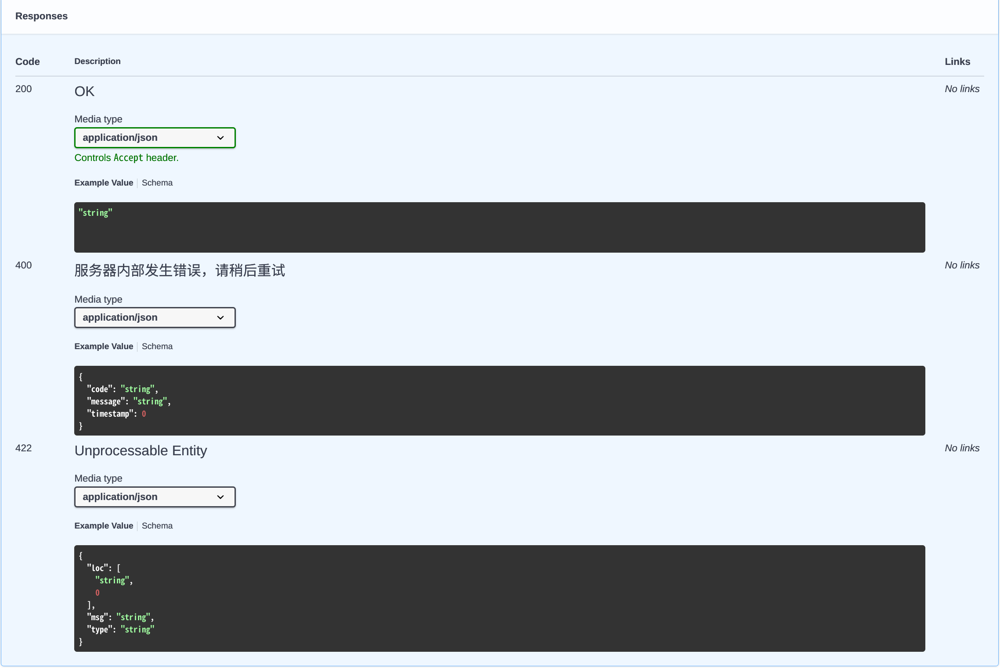
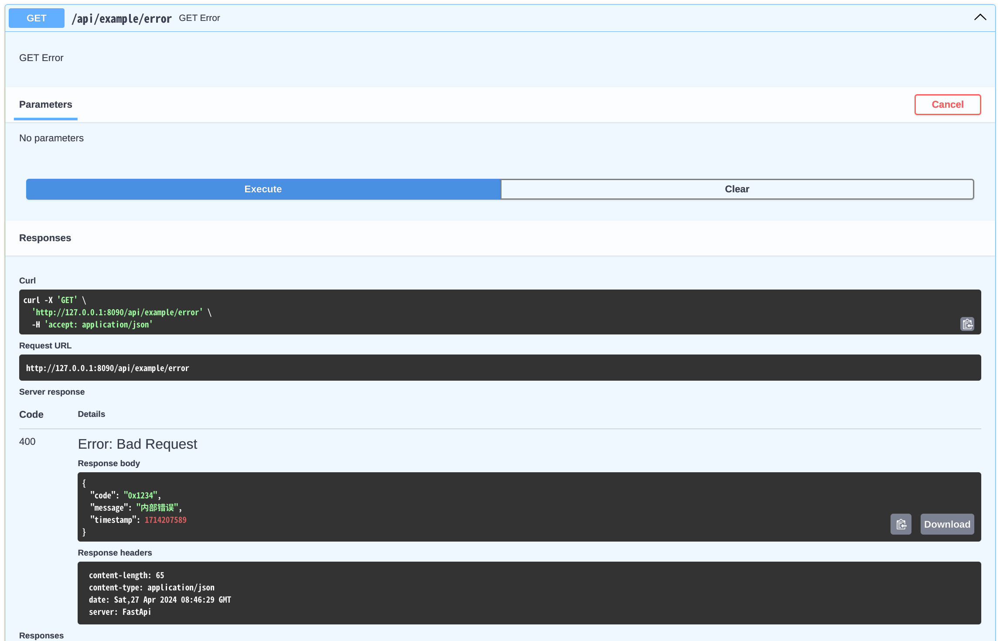

# RESTful API 开发指南

本文档详细说明基于 `GroupRouter` 的 HTTP RESTful API 开发方式。

> 快速上手请参阅 [README.md](../README.md) 的（一）（二）章节。
> MCP 接口开发请参阅 [MCP 支持文档](./mcp.md)。

## 1. 路由方法定义

路由定义的关键在于实现 [`GroupRouter`](../group_router.go) 接口：

| 方法 | 说明 |
|---|---|
| `Prefix() string` | 路由组前缀 |
| `Tags() []string` | 分组标签 |
| `PathSchema() pathschema.RoutePathSchema` | 路由解析规则，对路由前缀和路由地址都有效 |
| `Summary() map[string]string` | 为路由添加摘要说明，key 为原始的方法名，value 为摘要 |
| `Description() map[string]string` | 为路由添加详细说明，key 为原始的方法名，value 为详细描述（支持 markdown 显示） |
| `Path() map[string]string` | 自定义路径，可用于定义路径，key 为原始的方法名，value 为路径 |

对于路由组 `ExampleRouter` 来说：
- `Tags` 为 `ExampleRouter`
- 路由组前缀为手动定义的 `/api/example`

### 满足路由定义的方法要求

- 方法需为指针接收器
- 方法必须是导出方法
- 方法名必须以 HTTP 操作名开头或结尾：`Post`、`Patch`、`Get`、`Delete`、`Put`
- 返回值必须为 2 个参数：`(XXX, error)`，第二个参数必须是 `error` 类型，第一个参数为任意参数，但不建议是 `map` 类型，不能是 nil
- 第一个入参必须是 `*fastapi.Context`
  - 对于 `Post`、`Patch`、`Put` **至少有一个**自定义参数作为请求体，如果不需要请求体参数则用 `fastapi.None` 代替
  - 对于 `Get`、`Delete` 则**只能有一个**自定义结构体参数作为查询参数、cookies、header 等参数

## 2. 方法示例

### Get 方法

```go
// 返回一个字符串的 Get 方法
func (r *ExampleRouter) GetAppTitle(c *fastapi.Context) (string, error) {}

type UserInfoReq struct {
    // 查询参数名为 userId
    UserId int64 `json:"user_id" query:"userId" validate:"required" description:"用户ID"`
}

type UserInfoResp struct {
    UserInfoReq
    Name string `json:"name" validate:"required" description:"用户名称"`
    Age  int64  `json:"age" validate:"required" description:"用户年龄"`
}

// param 作为查询参数
func (r *ExampleRouter) GetUserInfo(c *fastapi.Context, param *UserInfoReq) (*UserInfoResp, error) {}
```

### Post 方法

```go
// param 作为请求体参数
func (r *ExampleRouter) PostUserInfo(c *fastapi.Context, param *UserInfoReq) (*UserInfoResp, error) {}
```

### Put 方法

```go
// param 作为请求体参数
func (r *ExampleRouter) PutUserInfo(c *fastapi.Context, param *UserInfoReq) (*UserInfoResp, error) {}
```

### Patch 方法

```go
// param 作为请求体参数
func (r *ExampleRouter) PatchUserInfo(c *fastapi.Context, param *UserInfoReq) (*UserInfoResp, error) {}
```

## 3. 文件上传

通过在 `Post`、`Put`、`Patch` 方法中添加 `*fastapi.File` 参数，即可实现文件上传。请求体类型固定为 `multipart/form-data`。

```go
// 仅上传文件
func (r *ExampleRouter) PostUploadFile(c *fastapi.Context, file *fastapi.File) (int64, error) {
    return 1, nil
}

type UpdateUserInfoReq struct {
    Name  string `json:"name" validate:"required"`
    Email string `json:"email" validate:"required"`
}

// 上传文件和 json 数据
func (r *ExampleRouter) PostUploadFileWithForm(c *fastapi.Context, file *fastapi.File, param *UpdateUserInfoReq) (int64, error) {
    return 1, nil
}
```

### 注意事项

当同时存在文件和 json 参数时，请把 `fastapi.File` 放在 `json` 参数之前：
`PostUploadFileWithForm(c *fastapi.Context, file *fastapi.File, param *UpdateUserInfoReq)`

此情况下，`json` 参数会作为**请求体**参数；如果 `fastapi.File` 放在 `json` 参数之后，则 `json` 参数会作为 `query` 参数：
`PostUploadFileWithForm(c *fastapi.Context, param *UpdateUserInfoReq, file *fastapi.File)`

由于反射过程中无法获得参数的名称，所以文件和 json 部分的字段名默认为 `file` 和 `param`，但可通过以下方法进行修改（必须在启动前设置）：

```go
fastapi.SetMultiFormFileName("files")
fastapi.SetMultiFormParamName("data")
```

## 4. 文件下载

通过返回 `*fastapi.FileResponse` 对象来向客户端发送文件。

```go
// 以附件形式下载文件
func (r *ExampleRouter) GetFileAttachment(c *fastapi.Context, param *DownloadFileReq) (*fastapi.FileResponse, error) {
    return fastapi.FileAttachment("../README.md", "README.md"), nil
}

// 直接发送文件内容给客户端
func (r *ExampleRouter) GetSendFile(c *fastapi.Context) (*fastapi.FileResponse, error) {
    return fastapi.SendFile("../README.md"), nil
}
```

文件下载支持以下方式：

| 方法 | 作用 |
|---|---|
| `SendFile` | 向客户端发送本地文件，读取文件内容作为响应体返回给客户端 |
| `FileAttachment` | 以附件形式返回本地文件，自动设置 `Content-Disposition`，浏览器触发自动下载 |
| `FileFromReader` | 从 `io.Reader` 中读取文件并返回给客户端 |
| `Stream` | 发送字节流到客户端，`Content-Type` 为 `application/octet-stream` |

## 5. SSE 推流

SSE 推流与具体的 HTTP Method 无关，既可以是 GET 请求也可以是 POST 请求等。
通过返回 `*fastapi.SSE` 对象来定义一个 SSE 路由，并通过 `Context.SSE` 向客户端发送 SSE 数据。

```go
// 返回值必须是 *fastapi.SSE，否则将无法正确的返回 SSE 数据
func (r *ExampleRouter) GetSse(c *fastapi.Context) (*fastapi.SSE, error) {
    for i := 1; i < 11; i++ {
        time.Sleep(time.Millisecond * 500)
        sse := &fastapi.SSE{
            Id:   fmt.Sprintf("%d", i),
            Data: []string{fmt.Sprintf("第%d次发送", i)},
        }
        if i == 5 {
            sse.Retry = 5000
        }
        if i%2 == 0 {
            sse.Event = "ding"
            sse.Data = append(sse.Data, "2的整数倍")
        }
        err := c.SSE(sse)
        if err != nil {
            return nil, err
        }
    }
    return &fastapi.SSE{}, nil
}
```

无需设置响应头，也无需关心消息结尾的换行符，框架会自动处理。

## 6. 方法入参解析规则

- 对于 `Get`、`Delete`：
  - 有且只有一个结构体入参，被解释为查询/路径等参数
- 对于 `Post`、`Patch`、`Put`：
  - 最后一个入参被解释为请求体，其他入参除 `fastapi.File` 外被解释为查询/路径等参数

### 参数定义

- 建议用**结构体**来定义所有参数
- 参数的校验和文档的生成遵循 `Validator` 的标签要求
- 任何情况下 `json` 标签都会被解释为参数名，对于查询参数则优先采用 `query` 标签名
- 任何模型都可以通过 `SchemaDesc() string` 方法来添加模型说明，作用等同于 `python.__doc__` 属性

## 7. 路由 URL 解析 [RoutePathSchema](../pathschema/pathschema.go)

方法开头或结尾中包含的 HTTP 方法名会被忽略，对于方法中包含多个关键字的仅第一个会被采用：
- `PostDelete` → 路由为 `/delete`，方法为 `Post`

允许通过 `PathSchema() pathschema.RoutePathSchema` 来自定义解析规则，支持以下规则：

| 规则 | 说明 | 示例 |
|---|---|---|
| `LowerCaseDash` | 全小写-短横线 | `get-clipboard-content` |
| `LowerCaseBackslash` | 全小写段路由 | `get/clipboard/content` |
| `LowerCamelCase` | 小驼峰 | `getClipboardContent` |
| `LowerCase` | 全小写直接拼接 | `getclipboardcontent` |
| `UnixDash` / `Dash` | 按单词分割用 "-" 连接 | `Get-Clipboard-Content` |
| `Underline` | 按单词分割用 "_" 连接 | `Get_Clipboard_Content` |
| `Backslash` | 按单词分段，每段一个路由段 | `/Get/Clipboard/Content` |
| `Original` | 原始不变（大驼峰） | `GetClipboardContent` |
| `AddPrefix` | 在每段路径前添加前缀字符 | 通常与其他方案组合 |
| `AddSuffix` | 在每段路径后添加后缀字符 | 通常与其他方案组合 |
| `Composition` | 组合式方案，按顺序执行多个 `RoutePathSchema` | — |

详细示例可见 [pathschema_test.go](../pathschema/pathschema_test.go)。

## 8. Config 配置项

参考 [`app.go:Config`](../app.go)：

| 参数 | 作用 | 默认值 |
|---|---|---|
| `Title` | APP 标题 | `FastAPI` |
| `Version` | APP 版本号 | `1.0.0` |
| `Description` | APP 描述 | `FastAPI Application` |
| `ShutdownTimeout` | 平滑关机超时（秒） | `5` |
| `DisableSwagAutoCreate` | 禁用 OpenApi 文档（不禁用参数校验） | `false` |
| `StopImmediatelyWhenErrorOccurs` | 遇到错误字段时立刻停止校验 | `false` |


## 9. 启动/关闭事件

等同于 `FastAPI.on_event()`，同步执行，应避免阻塞。

```go
app.OnEvent(fastapi.StartupEvent, func() {
    // 初始化数据库连接等
})

app.OnEvent(fastapi.ShutdownEvent, func() {
    // 清理资源
})
```

| 事件类型 | 触发时机 |
|---|---|
| `StartupEvent` | 初始化完成后、listen 之前 |
| `ShutdownEvent` | Context cancel 之后、mux shutdown 之前 |

## 10. 路由错误信息格式化

默认情况下当 handler 返回错误时，返回 `500` 状态码和 `string` 类型的错误消息。

允许通过 `Wrapper.SetRouteErrorFormatter` 自定义：

```go
type ErrorMessage struct {
    Code      string `json:"code,omitempty" description:"错误码"`
    Message   string `json:"message,omitempty" description:"错误信息"`
    Timestamp int64  `json:"timestamp,omitempty"`
}

func FormatErrorMessage(c *fastapi.Context, err error) (statusCode int, message any) {
    return 400, &ErrorMessage{
        Code:      "0x1234",
        Message:   err.Error(),
        Timestamp: time.Now().Unix(),
    }
}

// 自定义错误格式
app.SetRouteErrorFormatter(FormatErrorMessage, fastapi.RouteErrorOpt{
    StatusCode:   400,
    ResponseMode: &ErrorMessage{},
    Description:  "服务器内部发生错误，请稍后重试",
})
```




`RouteErrorFormatter` 的定义：

```go
// RouteErrorFormatter 路由函数返回错误时的处理函数
//
// 当路由函数返回错误时调用此函数，返回值作为响应码和响应内容
// 返回值仅限于可以 JSON 序列化的消息体
type RouteErrorFormatter func(c *Context, err error) (statusCode int, resp any)
```

其中实际接口响应的状态码以 `RouteErrorFormatter` 的返回值为准，`RouteErrorOpt` 的配置仅作用于文档显示。

## 11. 请求钩子（DependenceHandle）

```go
// DependenceHandle 依赖/钩子函数
type DependenceHandle func(c *Context) error
```

`Wrapper` 的核心实现类似于装饰器，而非常规中间件，因此暴露了锚点用于控制执行流程：

| 注册方法 | 执行时机 |
|---|---|
| `UsePrevious(hooks...)` | 请求参数校验**前**调用 |
| `UseAfter(hooks...)` | 请求参数校验**后**、路由函数调用**前**执行 |
| `UseBeforeWrite(fc)` | 数据写入响应流**前**执行（所有请求，无论成功/失败） |
| `Use(hooks...)` | `UseAfter` 的别名 |

执行顺序：

```
UsePrevious → Validate(请求参数) → UseAfter → RouteHandler → Validate(响应参数) → UseBeforeWrite → exit
```

使用示例：

```go
func BeforeValidate(c *fastapi.Context) error {
    c.Set("before-validate", time.Now())
    return nil
}

func PrintRequestLog(c *fastapi.Context) {
    fastapi.Info("请求耗时: ", time.Since(c.GetTime("before-validate")))
    fastapi.Info("响应状态码: ", c.Response().StatusCode)
}

func ReturnErrorDeps(c *fastapi.Context) error {
    return errors.New("deps return error")
}

app.UsePrevious(BeforeValidate)
app.Use(ReturnErrorDeps)
app.UseBeforeWrite(PrintRequestLog)
```

当依赖函数要终止后续流程时，返回 `error` 即可，错误消息会作为响应体返回给客户端。

与 Python-FastAPI 的 `Depends` 对比：
- Python 的 `Depends` 将返回值作为路由函数 Handler 的入参
- Go-FastApi 的 hook 不返回值，而是通过 `Context.Set` 和 `Context.Get` 传递上下文数据，通过返回 `error` 来终止后续流程
- `Context.Set` 和 `Context.Get` 是线程安全的
